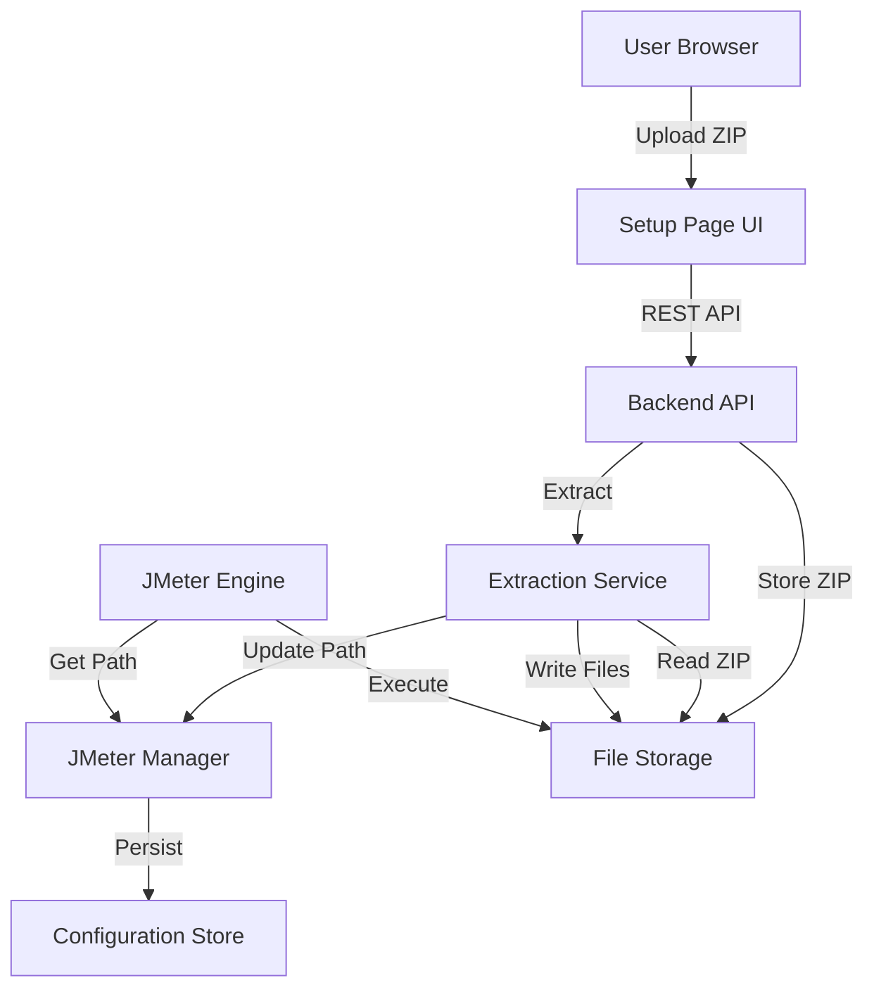

# Design Document: JMeter Setup Upload

## Overview

The JMeter Setup Upload feature extends the existing JMeter Web Runner application by providing a web-based interface for uploading and configuring JMeter distributions. This eliminates the need for users to manually install JMeter and configure system PATH variables. Users can upload a JMeter distribution ZIP file, and the system will automatically extract, validate, and configure it for use in test executions.

The feature integrates with the existing JMeter Web Runner architecture by:
- Adding a new setup page to the web frontend
- Providing API endpoints for JMeter distribution management
- Modifying the JMeter Engine to use the configured installation path
- Persisting JMeter configuration across application restarts

## Architecture

### High-Level Architecture



### Integration with Existing System

The feature integrates with the existing JMeter Web Runner by:

1. **Frontend Integration**: Add a new "Setup" tab or page alongside the existing file upload and execution pages
2. **JMeter Engine Modification**: Update the JMeter Engine to retrieve the JMeter binary path from JMeter Manager instead of relying on system PATH
3. **Startup Check**: Add a startup check that redirects users to the setup page if JMeter is not configured
4. **Configuration Persistence**: Store JMeter path in application configuration (properties file or database)

### Component Interaction Flow

**Upload and Setup Flow:**
1. User navigates to Setup Page
2. User selects JMeter ZIP file and clicks upload
3. Frontend sends ZIP file to API via multipart/form-data
4. API validates file extension (.zip)
5. API stores ZIP file temporarily
6. API invokes Extraction Service
7. Extraction Service validates ZIP structure (checks for bin/jmeter or bin/jmeter.bat)
8. Extraction Service extracts ZIP to designated directory (e.g., `jmeter/`)
9. Extraction Service verifies extracted JMeter binary
10. Extraction Service notifies JMeter Manager with installation path
11. JMeter Manager updates configuration with JMeter binary path
12. JMeter Manager verifies JMeter version by executing `jmeter -v`
13. API returns success response with JMeter version
14. Frontend displays success message with version information

**Status Check Flow:**
1. User opens Setup Page or application starts
2. Frontend requests JMeter status from API
3. API queries JMeter Manager for current configuration
4. JMeter Manager checks if JMeter path is configured
5. If configured, JMeter Manager verifies binary still exists and is executable
6. API returns status (configured/not configured) with version and path
7. Frontend displays current status

**Test Execution Flow (Modified):**
1. User triggers test execution (existing flow)
2. JMeter Engine requests JMeter binary path from JMeter Manager
3. If path not configured, return error "JMeter setup required"
4. If path configured, verify binary exists
5. Execute test using full path to JMeter binary
6. Continue with existing execution flow

## Components and Interfaces

### Setup Page Component (Frontend)

**Technology:** HTML, CSS, JavaScript

**Responsibilities:**
- Display current JMeter setup status
- Provide file upload interface for JMeter ZIP
- Show upload and extraction progress
- Display JMeter version and path when configured
- Handle replacement confirmation for existing installations
- Show error messages for invalid uploads

**Key UI Elements:**
- Status panel showing current JMeter configuration
- File upload form with drag-and-drop support
- Progress indicator during upload and extraction
- Version and path display
- "Check Status" button to refresh current state
- Warning dialog for replacing existing installation

**API Interactions:**
```javascript
// Get current JMeter status
GET /api/setup/status
Response: {
  configured: boolean,
  version: string | null,
  path: string | null,
  error: string | null
}

// Upload JMeter distribution
POST /api/setup/upload
Content-Type: multipart/form-data
Response: {
  success: boolean,
  version: string,
  path: string,
  message: string
}

// Remove existing installation
DELETE /api/setup/installation
Response: {
  success: boolean,
  message: string
}
```

### Setup API Endpoints (Backend)

**New Endpoints:**

```
GET    /api/setup/status           - Get current JMeter setup status
POST   /api/setup/upload           - Upload and configure JMeter distribution
DELETE /api/setup/installation     - Remove current JMeter installation
POST   /api/setup/verify           - Verify JMeter installation
```

**Endpoint Specifications:**

**GET /api/setup/status**
- Returns current JMeter configuration status
- Checks if JMeter binary exists and is executable
- Returns version information if available
- No request body required

**POST /api/setup/upload**
- Accepts multipart/form-data with ZIP file
- Validates file extension and size
- Invokes extraction and configuration process
- Returns success with version or error details
- Maximum file size: 200MB (configurable)

**DELETE /api/setup/installation**
- Checks for active test executions
- Removes JMeter installation directory
- Clears configuration
- Returns success or error if executions are active

**POST /api/setup/verify**
- Verifies current JMeter installation
- Executes `jmeter -v` to check functionality
- Returns version and status
- Used for health checks

### Extraction Service Component

**Responsibilities:**
- Validate ZIP file structure
- Extract ZIP file to designated directory
- Verify extracted JMeter binary
- Clean up on failure
- Detect JMeter version
- Handle both Unix and Windows JMeter distributions

**Extraction Process:**

```
1. Create temporary extraction directory
2. Extract ZIP file to temporary directory
3. Locate JMeter root directory (may be nested in ZIP)
4. Validate structure:
   - Check for bin/ directory
   - Check for lib/ directory
   - Check for jmeter or jmeter.bat in bin/
5. If valid:
   - Move to final installation directory (jmeter/)
   - Set executable permissions (Unix)
   - Clean up temporary directory
6. If invalid:
   - Clean up temporary directory
   - Throw validation error
```

**Validation Rules:**
- ZIP must contain a directory with bin/ subdirectory
- bin/ must contain jmeter (Unix) or jmeter.bat (Windows)
- lib/ directory should exist (contains JMeter libraries)
- Optional: Check for specific JMeter files (ApacheJMeter.jar)

**Directory Structure After Extraction:**
```
jmeter/
├── bin/
│   ├── jmeter (Unix)
│   ├── jmeter.bat (Windows)
│   └── [other binaries]
├── lib/
│   └── [JMeter libraries]
├── docs/
└── [other JMeter directories]
```

**Error Handling:**
- Invalid ZIP structure: "Invalid JMeter distribution. Missing required directories."
- Missing binary: "Invalid JMeter distribution. JMeter executable not found."
- Extraction failure: "Failed to extract JMeter distribution: {error details}"
- Permission errors: "Failed to set executable permissions: {error details}"

### JMeter Manager Component

**Responsibilities:**
- Store and retrieve JMeter installation path
- Validate JMeter availability
- Detect JMeter version
- Provide JMeter binary path to execution engine
- Persist configuration across restarts

**Configuration Storage:**

Option 1: Application Properties File
```properties
# application.properties
app.jmeter.installation-path=/path/to/jmeter
app.jmeter.version=5.6.3
app.jmeter.configured=true
```

Option 2: Database Table
```sql
CREATE TABLE jmeter_config (
  id INTEGER PRIMARY KEY,
  installation_path VARCHAR(500),
  version VARCHAR(50),
  configured_at TIMESTAMP,
  last_verified TIMESTAMP
);
```

**Recommended Approach:** Use application properties file for simplicity, with runtime updates.

**API Methods:**
```java
interface JMeterManager {
  // Set JMeter installation path
  void setInstallationPath(String path);
  
  // Get JMeter binary path (full path to executable)
  String getJMeterBinaryPath();
  
  // Check if JMeter is configured
  boolean isConfigured();
  
  // Verify JMeter installation and get version
  JMeterInfo verifyInstallation();
  
  // Clear configuration
  void clearConfiguration();
}

class JMeterInfo {
  String version;
  String path;
  boolean available;
  String error;
}
```

**Version Detection:**
Execute command: `{jmeter-path}/bin/jmeter -v`
Parse output for version string: "Version 5.6.3"

### Modified JMeter Engine Component

**Changes Required:**
- Replace system PATH lookup with JMeter Manager path retrieval
- Add pre-execution validation of JMeter availability
- Update error messages to indicate setup requirement

**Before (Current Implementation):**
```java
// Relies on jmeter being in system PATH
ProcessBuilder pb = new ProcessBuilder(
  "jmeter",
  "-n", "-t", testFile,
  "-l", resultsFile,
  "-e", "-o", reportDir
);
```

**After (Modified Implementation):**
```java
// Get JMeter path from manager
String jmeterPath = jmeterManager.getJMeterBinaryPath();
if (jmeterPath == null) {
  throw new JMeterNotConfiguredException(
    "JMeter is not configured. Please upload a JMeter distribution in the Setup page."
  );
}

// Verify JMeter is available
if (!Files.exists(Paths.get(jmeterPath))) {
  throw new JMeterNotAvailableException(
    "JMeter binary not found at configured path: " + jmeterPath
  );
}

// Use full path to JMeter binary
ProcessBuilder pb = new ProcessBuilder(
  jmeterPath,
  "-n", "-t", testFile,
  "-l", resultsFile,
  "-e", "-o", reportDir
);
```

**New Exception Types:**
- `JMeterNotConfiguredException`: Thrown when JMeter path is not configured
- `JMeterNotAvailableException`: Thrown when configured JMeter binary doesn't exist

## Data Models

### JMeterConfiguration Model
```java
class JMeterConfiguration {
  String installationPath;      // Path to JMeter root directory
  String binaryPath;             // Full path to jmeter executable
  String version;                // JMeter version (e.g., "5.6.3")
  LocalDateTime configuredAt;    // When configuration was set
  LocalDateTime lastVerified;    // Last successful verification
  boolean configured;            // Whether JMeter is configured
}
```

### SetupStatus Model
```java
class SetupStatus {
  boolean configured;            // Is JMeter configured?
  String version;                // JMeter version (null if not configured)
  String path;                   // Installation path (null if not configured)
  boolean available;             // Is JMeter binary accessible?
  String error;                  // Error message (null if no error)
}
```

### UploadResponse Model
```java
class UploadResponse {
  boolean success;               // Upload and extraction success
  String version;                // Detected JMeter version
  String path;                   // Installation path
  String message;                // Success or error message
}
```

## Correctness Properties


A property is a characteristic or behavior that should hold true across all valid executions of a system—essentially, a formal statement about what the system should do. Properties serve as the bridge between human-readable specifications and machine-verifiable correctness guarantees.

### Property 1: File Extension Validation

*For any* file upload request, the system should accept files with .zip extension and reject files without .zip extension, providing appropriate feedback in both cases.

**Validates: Requirements 1.1, 1.2**

### Property 2: Upload Response Completeness

*For any* file upload attempt (successful or failed), the API response should include appropriate feedback - either confirmation with filename and size for success, or a descriptive error message for failure.

**Validates: Requirements 1.3, 1.4**

### Property 3: JMeter Distribution Structure Validation

*For any* uploaded ZIP file, the system should validate that it contains a valid JMeter distribution structure (bin directory with jmeter or jmeter.bat executable) before accepting it.

**Validates: Requirements 1.5, 5.1, 5.2**

### Property 4: Extraction to Correct Location

*For any* valid JMeter ZIP file that is uploaded, the extraction service should extract it to the running folder at the designated location.

**Validates: Requirements 2.1**

### Property 5: Extraction Status Feedback

*For any* extraction operation, the system should provide status or progress information to the user during the extraction process.

**Validates: Requirements 2.2**

### Property 6: Post-Extraction Binary Verification

*For any* successful extraction, the system should verify that the JMeter binary exists at the expected location before marking the setup as complete.

**Validates: Requirements 2.3**

### Property 7: Extraction Failure Error Capture

*For any* extraction that fails, the system should capture error details and display them to the user with a descriptive message.

**Validates: Requirements 2.4**

### Property 8: Cleanup on Extraction Failure

*For any* extraction operation that fails, the system should clean up any partially extracted files, leaving no incomplete installation.

**Validates: Requirements 2.5**

### Property 9: Path Configuration After Extraction

*For any* successful JMeter extraction, the JMeter Manager should update the configuration to point to the newly extracted JMeter binary path.

**Validates: Requirements 3.1**

### Property 10: Binary Executability Verification

*For any* configured JMeter path, the JMeter Manager should verify that the binary at that path is executable.

**Validates: Requirements 3.2**

### Property 11: Configuration Confirmation with Version

*For any* successful JMeter configuration, the system should return confirmation that includes the detected JMeter version.

**Validates: Requirements 3.3**

### Property 12: Configuration Persistence Round-Trip

*For any* JMeter configuration that is set, restarting the application should preserve the configuration, making it available after restart.

**Validates: Requirements 3.4**

### Property 13: Path Replacement on New Upload

*For any* system with an existing JMeter installation, uploading a new JMeter distribution should replace the previous installation path with the new one.

**Validates: Requirements 3.5**

### Property 14: Status Information Completeness

*For any* status request, the system should return whether JMeter is configured, and include version and path when configured, or a prompt message when not configured.

**Validates: Requirements 4.1, 4.2, 4.3**

### Property 15: Invalid Structure Rejection

*For any* ZIP file that does not contain a valid JMeter structure (missing bin directory or executable), the system should reject it with a descriptive error message.

**Validates: Requirements 5.3**

### Property 16: Multi-Platform Executable Support

*For any* valid JMeter distribution containing either Unix (jmeter) or Windows (jmeter.bat) executables, the system should successfully validate and extract it.

**Validates: Requirements 5.4**

### Property 17: Validation Success Leads to Extraction

*For any* ZIP file that passes validation, the system should proceed with extraction rather than stopping at validation.

**Validates: Requirements 5.5**

### Property 18: Replacement Warning

*For any* upload attempt when a JMeter installation already exists, the system should provide a warning about replacement before proceeding.

**Validates: Requirements 6.1**

### Property 19: Old Installation Removal Before New Extraction

*For any* confirmed replacement operation, the system should remove the old installation completely before extracting the new one.

**Validates: Requirements 6.2**

### Property 20: Active Execution Check Before Removal

*For any* replacement attempt, the system should check for active test executions and prevent removal if any are found.

**Validates: Requirements 6.3, 6.4**

### Property 21: Configuration Update After Replacement

*For any* successful replacement operation, the JMeter Manager should update the configuration to point to the new installation path.

**Validates: Requirements 6.5**

### Property 22: Execution Uses Configured Path

*For any* test execution that is triggered, the JMeter Engine should use the JMeter binary path retrieved from the JMeter Manager rather than relying on system PATH.

**Validates: Requirements 7.1, 7.3**

### Property 23: Unconfigured JMeter Error

*For any* test execution attempt when JMeter is not configured, the system should return an error indicating that setup is required.

**Validates: Requirements 7.2**

### Property 24: Pre-Execution Availability Verification

*For any* test execution attempt, the JMeter Engine should verify JMeter availability before starting the execution.

**Validates: Requirements 7.4**

### Property 25: Graceful Failure on Unavailability

*For any* execution where JMeter becomes unavailable, the system should fail gracefully with a descriptive error message rather than crashing.

**Validates: Requirements 7.5**

## Error Handling

### Upload Errors

**Invalid File Extension:**
- HTTP Status: 400 Bad Request
- Response: `{"success": false, "error": "Invalid file type. Only .zip files are accepted."}`

**File Too Large:**
- HTTP Status: 413 Payload Too Large
- Response: `{"success": false, "error": "File size exceeds maximum limit of 200MB."}`

**Invalid JMeter Distribution:**
- HTTP Status: 400 Bad Request
- Response: `{"success": false, "error": "Invalid JMeter distribution. The ZIP file must contain a bin directory with jmeter executable."}`

**Storage Error:**
- HTTP Status: 500 Internal Server Error
- Response: `{"success": false, "error": "Failed to store uploaded file. Please try again."}`

### Extraction Errors

**Extraction Failure:**
- HTTP Status: 500 Internal Server Error
- Response: `{"success": false, "error": "Failed to extract JMeter distribution: {detailed error}"}`

**Invalid ZIP Format:**
- HTTP Status: 400 Bad Request
- Response: `{"success": false, "error": "Invalid ZIP file format. Please upload a valid JMeter distribution."}`

**Permission Error:**
- HTTP Status: 500 Internal Server Error
- Response: `{"success": false, "error": "Failed to set executable permissions on JMeter binary."}`

**Disk Space Error:**
- HTTP Status: 507 Insufficient Storage
- Response: `{"success": false, "error": "Insufficient disk space to extract JMeter distribution."}`

### Configuration Errors

**JMeter Not Found:**
- HTTP Status: 404 Not Found
- Response: `{"configured": false, "error": "JMeter is not configured. Please upload a JMeter distribution."}`

**Binary Not Executable:**
- HTTP Status: 500 Internal Server Error
- Response: `{"success": false, "error": "JMeter binary is not executable. Please check file permissions."}`

**Version Detection Failed:**
- HTTP Status: 500 Internal Server Error
- Response: `{"success": false, "error": "Failed to detect JMeter version. The installation may be corrupted."}`

### Replacement Errors

**Active Executions:**
- HTTP Status: 409 Conflict
- Response: `{"success": false, "error": "Cannot replace JMeter while test executions are active. Please wait for executions to complete."}`

**Removal Failed:**
- HTTP Status: 500 Internal Server Error
- Response: `{"success": false, "error": "Failed to remove existing JMeter installation: {detailed error}"}`

### Execution Errors

**JMeter Not Configured:**
- HTTP Status: 424 Failed Dependency
- Response: `{"error": "JMeter is not configured. Please upload a JMeter distribution in the Setup page."}`

**JMeter Not Available:**
- HTTP Status: 500 Internal Server Error
- Response: `{"error": "JMeter binary not found at configured path. Please reconfigure JMeter in the Setup page."}`

## Testing Strategy

### Dual Testing Approach

The system will be validated using both unit tests and property-based tests, which are complementary and together provide comprehensive coverage:

- **Unit tests** verify specific examples, edge cases, and error conditions
- **Property tests** verify universal properties across all inputs

Unit tests catch concrete bugs in specific scenarios, while property tests verify general correctness across a wide range of inputs.

### Unit Testing

Unit tests will focus on:

**Setup API Endpoint Testing:**
- Test status endpoint with configured and unconfigured states
- Test upload endpoint with valid JMeter ZIP
- Test upload endpoint with invalid files
- Test deletion endpoint with and without active executions
- Test error responses for various failure scenarios

**Extraction Service Testing:**
- Test extraction with valid JMeter ZIP files
- Test validation with invalid ZIP structures
- Test cleanup on extraction failure
- Test permission setting on Unix systems
- Test handling of nested ZIP structures

**JMeter Manager Testing:**
- Test path configuration and retrieval
- Test version detection
- Test persistence across restarts
- Test configuration clearing
- Test availability verification

**JMeter Engine Integration Testing:**
- Test execution with configured JMeter
- Test execution without configured JMeter
- Test error handling when JMeter becomes unavailable
- Test path usage (full path vs system PATH)

**Frontend Testing:**
- Test file upload UI with valid and invalid files
- Test status display for different states
- Test replacement confirmation dialog
- Test error message display

### Property-Based Testing

Property-based tests will validate the correctness properties defined above. Each property test will:
- Run a minimum of 100 iterations with randomized inputs
- Reference the design document property it validates
- Use the tag format: **Feature: jmeter-setup-upload, Property {number}: {property_text}**

**Property Testing Library:**
The implementation will use jqwik for Java-based property testing, which is already used in the existing JMeter Web Runner codebase.

**Property Test Examples:**

*Property 1: File Extension Validation*
- Generate random filenames with and without .zip extension
- Verify acceptance for .zip files and rejection for others
- Tag: **Feature: jmeter-setup-upload, Property 1: File Extension Validation**

*Property 3: JMeter Distribution Structure Validation*
- Generate ZIP files with various directory structures
- Include valid structures (with bin/jmeter) and invalid structures
- Verify correct acceptance/rejection based on structure
- Tag: **Feature: jmeter-setup-upload, Property 3: JMeter Distribution Structure Validation**

*Property 12: Configuration Persistence Round-Trip*
- Generate random JMeter configurations
- Save configuration, simulate restart, verify configuration persists
- Tag: **Feature: jmeter-setup-upload, Property 12: Configuration Persistence Round-Trip**

*Property 20: Active Execution Check Before Removal*
- Generate scenarios with and without active executions
- Verify removal is blocked when executions are active
- Tag: **Feature: jmeter-setup-upload, Property 20: Active Execution Check Before Removal**

### Integration Testing

Integration tests will verify:
- End-to-end flow: upload → extract → configure → execute test
- Status checks at each stage of setup
- Replacement flow with existing installation
- Error recovery and cleanup
- Integration with existing JMeter Web Runner features

### Test Environment

**Requirements:**
- File system access for extraction and storage
- Ability to create and delete directories
- Test fixtures: sample JMeter ZIP files (valid and invalid)
- Mock or test configuration storage

**Test Data:**
- Valid JMeter distribution ZIP files (Unix and Windows versions)
- Invalid ZIP files (missing bin directory, missing executable)
- Corrupted ZIP files
- Non-ZIP files with .zip extension
- Edge case filenames (special characters, very long names)

### Test Coverage Goals

- Minimum 80% code coverage for backend API and services
- 100% coverage of error handling paths
- All 25 correctness properties validated by property tests
- All critical user flows covered by integration tests
- Both Unix and Windows JMeter distributions tested

### Testing Considerations

**Platform-Specific Testing:**
- Test executable detection for both jmeter (Unix) and jmeter.bat (Windows)
- Test permission setting on Unix systems
- Test path handling for different operating systems

**Concurrency Testing:**
- Test upload while extraction is in progress
- Test replacement attempt during active executions
- Test multiple status checks simultaneously

**Cleanup Testing:**
- Verify temporary files are removed after successful extraction
- Verify partial extractions are cleaned up on failure
- Verify old installations are fully removed during replacement
