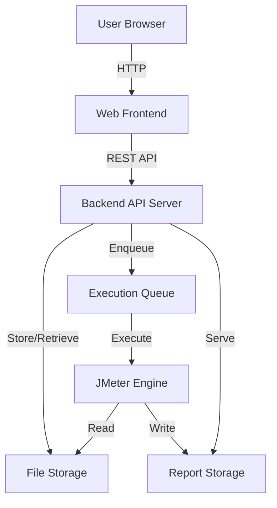

# Design Document: JMeter Web Runner

## Overview

The JMeter Web Runner is a web-based application that enables users to upload JMeter test files (JMX format), execute them on a server, and view or download the generated reports. The system consists of a web frontend for user interaction, a backend API for orchestration, and a JMeter execution engine for running tests.

The architecture follows a three-tier design:
- **Frontend**: Web interface for file upload, test execution control, and report viewing
- **Backend API**: RESTful service handling file management, test orchestration, and report serving
- **Execution Engine**: JMeter process manager that runs tests and generates reports

## Architecture

### High-Level Architecture



### Component Interaction Flow

**Upload Flow:**
1. User selects JMX file in browser
2. Frontend sends file to API via multipart/form-data
3. API validates file extension and XML format
4. API stores file in file storage with unique identifier
5. API returns success response with file metadata

**Execution Flow:**
1. User triggers test execution for uploaded file
2. API creates execution record with "queued" status
3. API adds execution to queue
4. Queue manager assigns execution to available JMeter process
5. JMeter reads test file and executes test
6. JMeter generates reports in designated output directory
7. Execution status updates to "completed" or "failed"
8. API notifies frontend of completion

**Report Access Flow:**
1. User requests to view/download report
2. API retrieves report files from storage
3. For view: API serves HTML report for browser rendering
4. For download: API packages report files into ZIP archive
5. Frontend displays or downloads report

## Components and Interfaces

### Frontend Component

**Technology:** HTML, CSS, JavaScript (vanilla or lightweight framework)

**Responsibilities:**
- Render file upload interface
- Display list of uploaded test files
- Provide test execution controls
- Show execution status and progress
- Display reports in browser
- Handle report downloads

**Key UI Elements:**
- File upload form with drag-and-drop support
- Test file list with action buttons (Execute, Delete)
- Execution status panel showing active/queued tests
- Report viewer with embedded HTML display
- Download button for report packages

### Backend API Component

**Technology:** RESTful API (language-agnostic design)

**Endpoints:**

```
POST   /api/files              - Upload JMX file
GET    /api/files              - List all uploaded files
DELETE /api/files/{id}         - Delete a file
POST   /api/executions         - Start test execution
GET    /api/executions         - List all executions
GET    /api/executions/{id}    - Get execution status
GET    /api/reports/{id}       - View report (HTML)
GET    /api/reports/{id}/download - Download report (ZIP)
```

**Responsibilities:**
- Handle HTTP requests and responses
- Validate file uploads (extension, size, XML format)
- Manage file storage operations
- Orchestrate test executions via queue
- Track execution status
- Serve report files
- Handle errors and return appropriate status codes

**API Request/Response Formats:**

Upload File:
```json
POST /api/files
Content-Type: multipart/form-data

Response:
{
  "id": "uuid",
  "filename": "test.jmx",
  "size": 12345,
  "uploadedAt": "2026-01-09T10:30:00Z"
}
```

Start Execution:
```json
POST /api/executions
{
  "fileId": "uuid"
}

Response:
{
  "id": "exec-uuid",
  "fileId": "uuid",
  "status": "queued",
  "queuePosition": 2,
  "createdAt": "2026-01-09T10:35:00Z"
}
```

Get Execution Status:
```json
GET /api/executions/{id}

Response:
{
  "id": "exec-uuid",
  "fileId": "uuid",
  "status": "running|completed|failed|queued",
  "queuePosition": 0,
  "startedAt": "2026-01-09T10:36:00Z",
  "completedAt": "2026-01-09T10:40:00Z",
  "duration": 240,
  "reportId": "report-uuid",
  "error": null
}
```

### Execution Queue Component

**Responsibilities:**
- Maintain queue of pending test executions
- Enforce concurrency limits (configurable max concurrent executions)
- Assign executions to available JMeter processes
- Track execution state transitions
- Provide queue position information

**Queue States:**
- `queued`: Waiting for execution slot
- `running`: Currently executing
- `completed`: Finished successfully
- `failed`: Execution error occurred

**Concurrency Management:**
- Configuration parameter: `MAX_CONCURRENT_EXECUTIONS` (default: 2)
- When execution completes, automatically start next queued item
- Thread-safe queue operations to prevent race conditions

### JMeter Engine Component

**Responsibilities:**
- Execute JMeter tests using command-line interface
- Generate standard JMeter reports (HTML dashboard)
- Capture execution logs and errors
- Write reports to designated storage location

**Execution Command:**
```bash
jmeter -n -t /path/to/test.jmx -l /path/to/results.jtl -e -o /path/to/report/
```

**Parameters:**
- `-n`: Non-GUI mode
- `-t`: Test file path
- `-l`: Results log file (JTL format)
- `-e`: Generate report dashboard after load test
- `-o`: Output folder for report dashboard

**Error Handling:**
- Capture stderr and stdout from JMeter process
- Parse exit codes (0 = success, non-zero = failure)
- Store error messages in execution record
- Clean up partial reports on failure

### Storage Component

**File Storage Structure:**
```
storage/
├── uploads/
│   └── {file-id}.jmx
└── reports/
    └── {execution-id}/
        ├── index.html
        ├── results.jtl
        ├── statistics.json
        └── content/
            └── [report assets]
```

**Responsibilities:**
- Persist uploaded JMX files
- Store generated reports with all assets
- Provide file retrieval operations
- Handle file deletion

**Storage Operations:**
- `saveFile(id, content)`: Store uploaded file
- `getFile(id)`: Retrieve file content
- `deleteFile(id)`: Remove file
- `saveReport(executionId, reportPath)`: Store report directory
- `getReport(executionId)`: Retrieve report files
- `packageReport(executionId)`: Create ZIP archive of report

## Data Models

### File Model
```
{
  id: string (UUID)
  filename: string
  size: number (bytes)
  uploadedAt: timestamp
  path: string (storage path)
}
```

### Execution Model
```
{
  id: string (UUID)
  fileId: string (references File)
  status: enum (queued, running, completed, failed)
  queuePosition: number
  createdAt: timestamp
  startedAt: timestamp | null
  completedAt: timestamp | null
  duration: number | null (seconds)
  reportId: string | null
  error: string | null
}
```

### Report Model
```
{
  id: string (UUID)
  executionId: string (references Execution)
  path: string (storage path)
  createdAt: timestamp
  size: number (bytes)
}
```


## Correctness Properties

A property is a characteristic or behavior that should hold true across all valid executions of a system—essentially, a formal statement about what the system should do. Properties serve as the bridge between human-readable specifications and machine-verifiable correctness guarantees.

### Property 1: File Extension Validation

*For any* file upload request, the system should accept files with .jmx extension and reject files without .jmx extension.

**Validates: Requirements 1.1, 1.2**

### Property 2: Upload Response Completeness

*For any* file upload (successful or failed), the API response should include appropriate feedback - either confirmation with filename for success, or a descriptive error message for failure.

**Validates: Requirements 1.3, 1.4**

### Property 3: XML Format Validation

*For any* uploaded file with .jmx extension, the system should validate that the file content is valid XML format before accepting it.

**Validates: Requirements 1.5**

### Property 4: Execution Creation

*For any* valid uploaded file, triggering execution should create an execution record with initial status "queued".

**Validates: Requirements 2.1**

### Property 5: Execution Status Tracking

*For any* execution, querying its status should return the current state (queued, running, completed, or failed) along with relevant metadata.

**Validates: Requirements 2.2, 3.3**

### Property 6: Successful Execution Completion

*For any* execution that completes successfully, the execution record should have status "completed" and include a report ID for accessing the generated report.

**Validates: Requirements 2.3, 2.5, 3.1**

### Property 7: Failed Execution Error Capture

*For any* execution that fails, the execution record should have status "failed" and include a descriptive error message explaining the failure.

**Validates: Requirements 2.4**

### Property 8: Report Accessibility

*For any* completed execution, requesting the report via the view endpoint should return HTML content that can be rendered in a browser.

**Validates: Requirements 3.2**

### Property 9: Multiple Report Support

*For any* set of test executions, each completed execution should have its own accessible report that can be viewed independently.

**Validates: Requirements 3.5**

### Property 10: Report Download Availability

*For any* completed execution, the download endpoint should serve a ZIP archive containing the complete report package.

**Validates: Requirements 4.1, 4.3**

### Property 11: Report Archive Completeness

*For any* downloaded report archive, it should contain all required artifacts including HTML files, result logs (JTL), and any generated statistics or assets.

**Validates: Requirements 4.2, 4.4**

### Property 12: Report Persistence After Download

*For any* report that has been downloaded, the report should remain accessible via the view endpoint for future access.

**Validates: Requirements 4.5**

### Property 13: File List Completeness

*For any* set of uploaded files, the list endpoint should return all files with complete metadata including filename, upload date, and size.

**Validates: Requirements 5.1, 5.2**

### Property 14: File Operations Availability

*For any* uploaded file in the system, both execute and delete operations should be available and functional.

**Validates: Requirements 5.3**

### Property 15: File Deletion Consistency

*For any* file that is deleted, subsequent list requests should not include that file, confirming removal from storage.

**Validates: Requirements 5.4**

### Property 16: Execution Queueing

*For any* set of execution requests submitted when the system is at capacity, they should be queued with appropriate queue positions assigned.

**Validates: Requirements 6.1, 6.3**

### Property 17: Concurrency Limit Enforcement

*For any* configured concurrency limit, the number of simultaneously running executions should never exceed that limit.

**Validates: Requirements 6.2**

### Property 18: Automatic Queue Processing

*For any* queued execution, when an execution slot becomes available (due to completion of a running execution), the next queued execution should automatically transition to "running" status.

**Validates: Requirements 6.4**

### Property 19: Execution List Completeness

*For any* set of executions in the system, the executions list endpoint should return all executions with their current status (active, queued, completed, or failed).

**Validates: Requirements 6.5**

## Error Handling

### File Upload Errors

**Invalid File Extension:**
- HTTP Status: 400 Bad Request
- Response: `{"error": "Invalid file type. Only .jmx files are accepted."}`

**Invalid XML Format:**
- HTTP Status: 400 Bad Request
- Response: `{"error": "Invalid JMX file. File must be valid XML format."}`

**File Too Large:**
- HTTP Status: 413 Payload Too Large
- Response: `{"error": "File size exceeds maximum limit of {MAX_SIZE}MB."}`

**Storage Error:**
- HTTP Status: 500 Internal Server Error
- Response: `{"error": "Failed to store file. Please try again."}`

### Execution Errors

**File Not Found:**
- HTTP Status: 404 Not Found
- Response: `{"error": "Test file not found."}`

**JMeter Execution Failure:**
- Execution status: "failed"
- Error captured in execution record
- Example: `{"error": "JMeter execution failed: Invalid test plan configuration"}`

**Report Generation Failure:**
- Execution status: "failed"
- Error captured in execution record
- Example: `{"error": "Failed to generate report: Insufficient test results"}`

### Report Access Errors

**Report Not Found:**
- HTTP Status: 404 Not Found
- Response: `{"error": "Report not found."}`

**Report Not Ready:**
- HTTP Status: 409 Conflict
- Response: `{"error": "Report is not yet available. Execution status: {status}"}`

### General Errors

**Invalid Request:**
- HTTP Status: 400 Bad Request
- Response: `{"error": "Invalid request parameters."}`

**Resource Not Found:**
- HTTP Status: 404 Not Found
- Response: `{"error": "Resource not found."}`

**Internal Server Error:**
- HTTP Status: 500 Internal Server Error
- Response: `{"error": "An unexpected error occurred. Please try again."}`

## Testing Strategy

### Dual Testing Approach

The system will be validated using both unit tests and property-based tests, which are complementary and together provide comprehensive coverage:

- **Unit tests** verify specific examples, edge cases, and error conditions
- **Property tests** verify universal properties across all inputs

Unit tests catch concrete bugs in specific scenarios, while property tests verify general correctness across a wide range of inputs.

### Unit Testing

Unit tests will focus on:

**API Endpoint Testing:**
- Test each endpoint with valid inputs
- Test error responses for invalid inputs
- Test edge cases (empty files, special characters in filenames)
- Test authentication and authorization (if implemented)

**File Validation Testing:**
- Test with valid JMX files
- Test with invalid XML
- Test with non-XML files
- Test with empty files
- Test with files at size limits

**Execution Management Testing:**
- Test execution creation
- Test status transitions
- Test queue management
- Test concurrency limits
- Test error scenarios

**Report Generation Testing:**
- Test report storage
- Test report retrieval
- Test ZIP archive creation
- Test missing report scenarios

### Property-Based Testing

Property-based tests will validate the correctness properties defined above. Each property test will:
- Run a minimum of 100 iterations with randomized inputs
- Reference the design document property it validates
- Use the tag format: **Feature: jmeter-web-runner, Property {number}: {property_text}**

**Property Testing Library:**
The implementation will use an appropriate property-based testing library for the chosen language:
- Python: Hypothesis
- JavaScript/TypeScript: fast-check
- Java: jqwik or QuickCheck
- Go: gopter

**Property Test Examples:**

*Property 1: File Extension Validation*
- Generate random filenames with and without .jmx extension
- Verify acceptance/rejection based on extension
- Tag: **Feature: jmeter-web-runner, Property 1: File Extension Validation**

*Property 5: Execution Status Tracking*
- Generate random execution states
- Verify status queries return correct current state
- Tag: **Feature: jmeter-web-runner, Property 5: Execution Status Tracking**

*Property 17: Concurrency Limit Enforcement*
- Generate random execution requests exceeding limit
- Verify running count never exceeds configured limit
- Tag: **Feature: jmeter-web-runner, Property 17: Concurrency Limit Enforcement**

### Integration Testing

Integration tests will verify:
- End-to-end flows (upload → execute → view report)
- Component interactions (API ↔ Storage ↔ JMeter Engine)
- Queue processing with multiple concurrent executions
- Report generation and retrieval

### Test Environment

**Requirements:**
- JMeter installed and available in PATH
- File system access for storage
- Test fixtures: sample JMX files (valid and invalid)
- Mock or test database for execution tracking

**Test Data:**
- Valid JMX test files of various sizes
- Invalid XML files
- Non-XML files with .jmx extension
- Edge case filenames (special characters, very long names)

### Test Coverage Goals

- Minimum 80% code coverage for backend API
- 100% coverage of error handling paths
- All 19 correctness properties validated by property tests
- All critical user flows covered by integration tests
